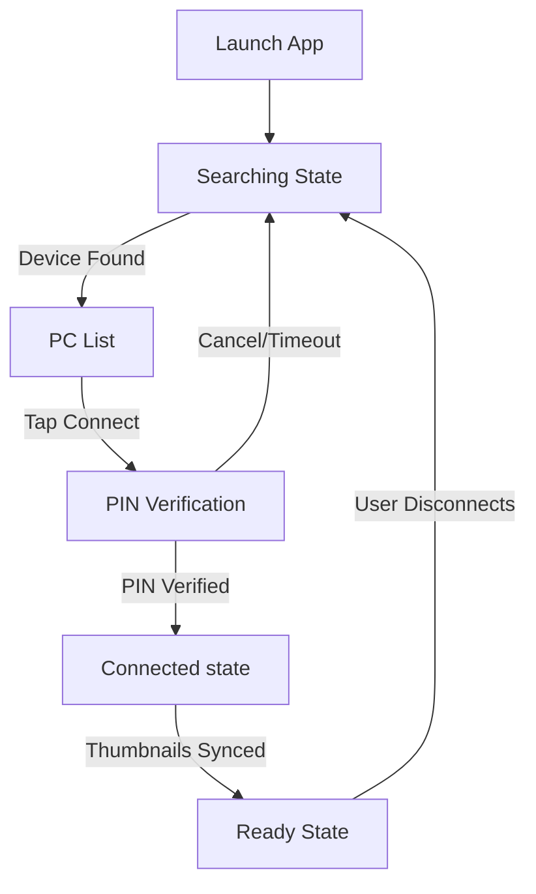

# MediaBridge iOS UI/UX Design Specification

## Overview
MediaBridge iOS is an "invisible" companion app. Its primary goal is to facilitate a connection with the Windows desktop application with minimal user friction. The interface is strictly utilitarian, guiding the user through the connection handshake and then stepping back to allow the Windows app to take control.

## Design Principles
1.  **Zero Configuration**: No settings menus, no IP entry. Auto-discovery is the default.
2.  **Linear Flow**: The user is guided through a strict state machine: `Searching -> List -> PIN -> Connected`.
3.  **Feedback First**: Explicit status indicators (Scanning pulses, Connection dots, Sync progress) reassure the user.

## User Flow

## Screen Specifications

### 1. Searching Screen
**Goal**: Reassure user that the app is working while looking for a host.
*   **Visuals**:
    *   Central Pulse Animation: A large, soft blue ripple radiating from a WiFi icon.
    *   Status Text: "Searching for PCs..." in a neutral gray.
*   **Interactions**: None. Passive state.
*   **Troubleshooting**: "Make sure MediaBridge is open on Windows" hint at the bottom.

### 2. PC Selection List
**Goal**: Clear identification of available targets.
*   **Layout**: Simple list view.
*   **Item Styles**:
    *   **Icon**: Laptop symbol (SF Symbol `laptopcomputer`) in Blue.
    *   **Title**: Computer Name (e.g., "Dennis's MacBook").
    *   **Subtitle**: IP Address (e.g., "192.168.1.50") for technical verification.
    *   **Action**: Chevron or "Connect" button on the right.

### 3. PIN Verification (Security Handshake)
**Goal**: Secure the connection without typing on the phone.
*   **Layout**: Modal or focused center view.
*   **Key Element**: Large, high-contrast 4-digit PIN (e.g., `8 4 7 2`).
*   **Typography**: Monospaced font for legibility.
*   **Instruction**: "Enter this PIN on your computer."
*   **Timeout**: Visual countdown (30s) or text indicator.

### 4. Connected & Syncing
**Goal**: Show activity during the initial data dump.
*   **Visuals**:
    *   Hero Icon: Blue spinning sync arrows (`arrow.triangle.2.circlepath`).
    *   Progress Bar: Linear progress indicating thumbnail transfer status.
    *   Status Text: "Syncing Thumbnails...".

### 5. Ready Mode (Passive)
**Goal**: Indicate the phone is effectively a detached drive.
*   **Visuals**:
    *   Green Checkmark (`checkmark.circle.fill`) dominating the screen.
    *   Status Text: "Ready for Transfer".
    *   Secondary Text: "Select photos on your computer."
*   **Actions**: Only one primary action available: **Disconnect** (Red, destructive).

## Feedback & Animations
*   **Transitions**: Smooth cross-dissolves between states.
*   **Success**: Haptic feedback (UINotificationFeedbackGenerator - Success) when PIN is verified.
*   **Error**: Haptic feedback (Error) and red shake animation if connection fails or PIN is rejected.
